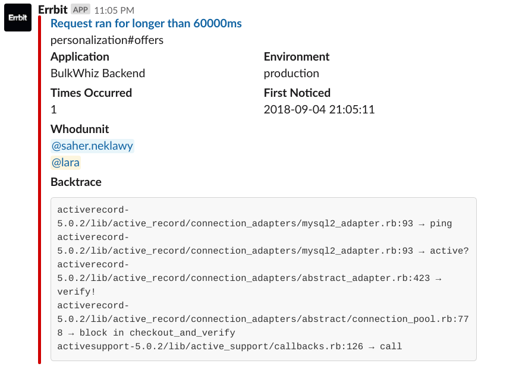
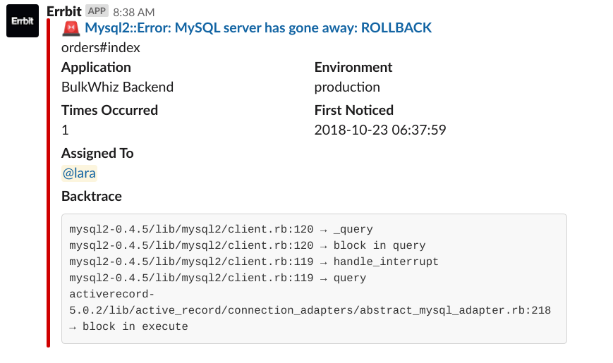
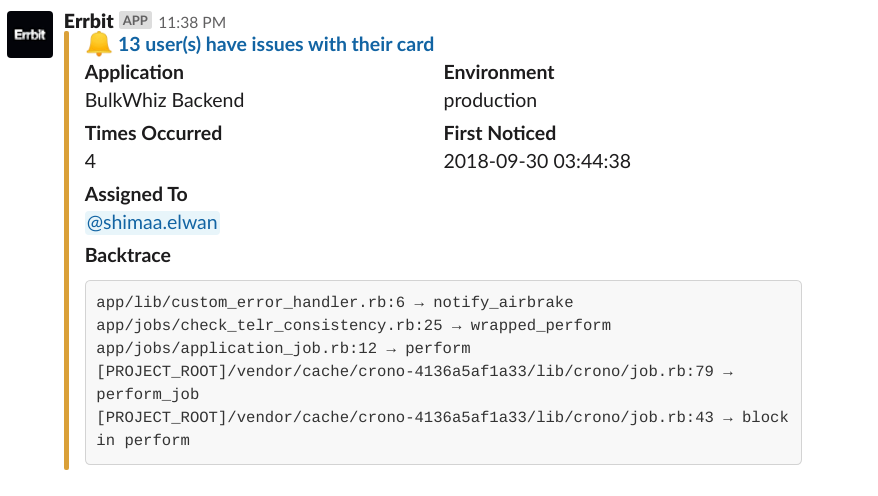
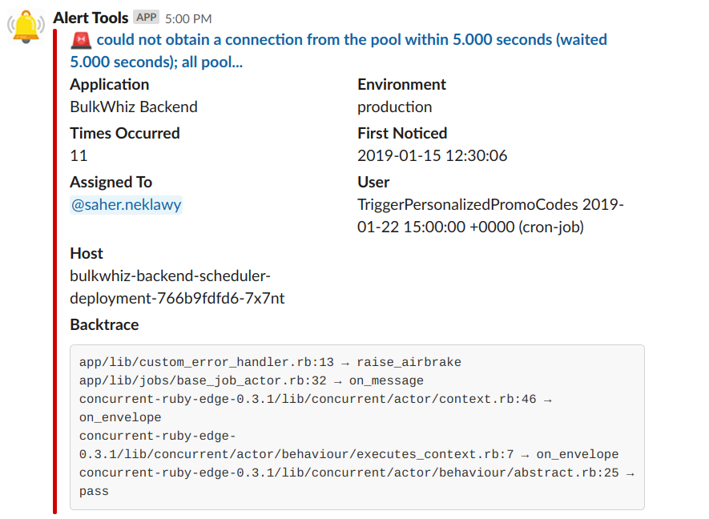
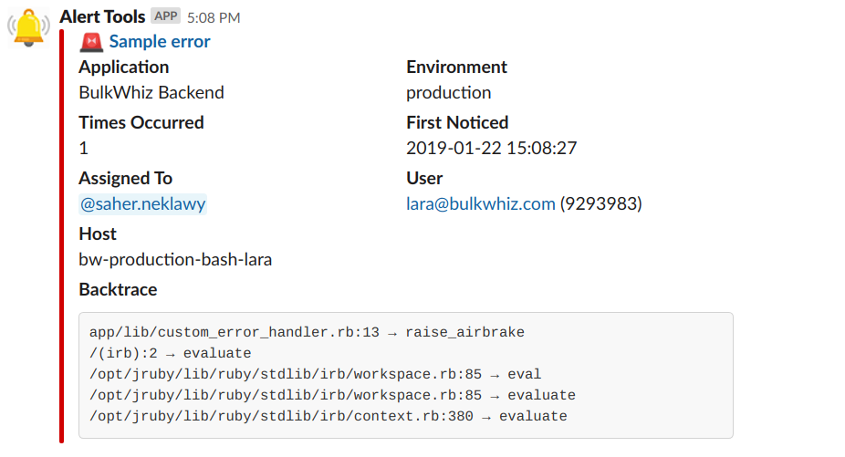

_This blog post was originally published on January 23, 2019 on the BulkWhiz tech, business, and operations blog, Whizardry, [here](https://medium.com/whizardry/an-error-alerting-system-of-ones-own-d3850781ca18?source=---------2------------------)._

> "Software engineering is strewn with the wreckage of those who have relied beyond reason solely on the error alerting configurations of others."
>
> — Virginia Woolf, paraphrased

Picture this. It's 5PM on a Saturday. By some twist of fate you do not yet completely understand, you've ended up both on call and committed to a family dinner at this ungodly hour of the Sabbath. You think it'll be fine; you'll just keep your laptop handy and periodically check your phone for error alerts until you safely ride out your on-call time slot. Right?

<!-- more -->

Fast forward to 6:07PM. You're sprawled on the floor of your grandma's bedroom, both laptop and phone open to your Slack alert channels and a shell on a production machine running, all on mobile data. Some production issue has vital services down and alerts that all look the same rolling in every millisecond. Your product manager is going crazy, and you yourself can barely breathe, let alone figure out what's wrong and fix it. You start ruing the day you went into software engineering and wondering if pyramid schemes really are the scam they very obviously are.

# Alerts, alerts, alerts

Before you call your friend who pitched you the latest Ponzi, know it doesn't have to be that way. As hyperbolic as the above hypothetical situation is, it captures the essence of a very real software engineering problem: [on-call fatigue](https://victorops.com/blog/avoiding-on-call-alert-fatigue-and-the-corresponding-effects?utm_source=Sponsorship&utm_medium=Newsletter&utm_content=MonitoringAlerting_Listicle&utm_vendor=DevOpsWeekly). Yes, it's great that you have an error monitoring system in place and that you've linked it to your workplace messaging app, but constantly seeing alerts that all look the same coming in at a huge frequency is just overwhelming. As time goes on, stress and burnout build up within the engineering team, production environment deviance becomes normalized, and issues are either unresolved or resolved very inefficiently.

Because of this, we decided to personalize our error alerting system. We narrowed down the problem into three major sub-problems:

1. alerts weren't being routed to the concerned team members,
2. there was no way to differentiate between them at a glance, and
3. they had too little helpful information.

We use [Errbit](https://github.com/errbit/errbit), an open-source Airbrake-API-compliant error catcher that, like our own BulkWhiz API, is written in Ruby-on-Rails. Errbit supports a number of notification services (and, as per the essence of this post, you can always extend it to support even more), but we use Slack so that's what I'll focus on here.

To get started, we [forked the Errbit repo on GitHub](https://help.github.com/articles/fork-a-repo/), [created a Docker image and pushed it to DockerHub](https://www.techrepublic.com/article/how-to-create-a-docker-image-and-push-it-to-docker-hub/), [initialized a test Errbit Kubernetes deployment pointing to that image and routed staging alerts to it](https://kubernetes.io/docs/concepts/workloads/controllers/deployment/#creating-a-deployment), and we were good to go!

# [Don't @ me](https://www.urbandictionary.com/define.php?term=don%E2%80%99t%20%40%20me) — but actually @ me

What if you didn't have to worry about every single alert ever but only the ones you were mentioned in? No more keeping tabs on the alerts channel for a good half hour after pushing production changes or analyzing a backtrace to figure out which fellow team member to tag. Our first thought was: Create a routing system within Errbit that gets `git blame` information from [GitHub's GraphQL API](https://developer.github.com/v4/). Map the returned JSON to the in-app files and line numbers in the error's backtrace and you have the GitHub usernames of the code authors. Map _those_ to their corresponding Slack user IDs which you can get from the Slack API, either by getting them from [Slack's API method testing interface](https://api.slack.com/methods) and passing them in an environmental variable to your Errbit deployment or, cleaner and more robust to changes, calling Slack's API from inside your Errbit code.

_One of our first alerts with code author mentions. In the code, this is_ _[how the mentions work](https://api.slack.com/docs/message-formatting#linking_to_channels_and_users):_ `"<@#{slack_user_id}>"`_._

Now that's all good and well, but "whodunnit" isn't necessarily "whogottadealwithit." As such, we implemented a force-assignment system, mapping certain error classes to the Slack user IDs of the responsible team members and checking that hash first before sending the `git blame` request. We thus had to create some custom error classes from our BulkWhiz API codebase to be able to raise those force-assigned errors where needed. Force assignment also proved useful in situations where the code author was no longer part of the team, or where the error at hand was a broader issue that more than one team member needed to deal with. In those cases, we decided to tag Slack user groups instead of individual users. (Pro tip: Slack user **group** mentions work a bit differently:

`"<!subteam^#{slack_user_id}|#{slack_user_name}>"`.)

# Triage and error

To make processing alerts even faster, we needed to begin differentiating between their levels of severity at a glance. Some alerts are actually uncaught exceptions, whereas others are notifications we manually raise from the BulkWhiz API codebase to trigger certain actions, both automated and human. Using color coding and emojis, we're now able to visually differentiate between those two alert types at first sight.

_Exception versus notification. For notifications that do not have force assignments, we refrain from falling back on mentioning code authors to avoid unnecessary noise. (On a side note, notice how "Whodunnit" became "Assigned To"?)_

You'll notice by looking at the "Environment" key that all these are production errors. In the beginning, I mentioned that we had set up a sandbox environment using staging errors. That's another way in which we triage errors: Configuring our app to send production and staging alerts each to a separate Errbit deployment, both of which pull the same image (or different branches of that image if we which to test code changes first) but send alerts to separate Slack channels. To further filter out the most severe and urgent of errors, we then [use an automation engine called StackStorm](https://stackstorm.com/) to send those alerts to a third Slack channel. That way, we can tell which alerts require immediate attention and which can wait.

# Knowledge is power\*

But only when you have the right parts of it — and the affected user is one of those. The Airbrake API already includes that information in the `context` key of the `Notice` object it creates on catching an error. This is unfortunately lost when you manually send a bare error to Airbrake/Errbit, so make sure you wrap your error in a `Notice` object first.

_Cronjobs are users too!_

Sending the hostname, a detail already captured by Airbrake/Errbit, to Slack is also a good way to be able to quickly tell where the problem is, especially in a Kubernetes cluster where one [pod](https://kubernetes.io/docs/concepts/workloads/pods/pod/) or [node](https://kubernetes.io/docs/concepts/architecture/nodes/) could be down or where you could be routing certain requests to certain pods.

# Smarter, better, stronger

We set out to customize our error alerting system with three goals:

1. to reduce noise,
2. to streamline triage, and
3. to enhance the information sent.

While the above configurations have helped us make tremendous strides towards reaching these goals, they can also be improved upon in future iterations.

Having a smarter routing model that mentions the author of the latest change in the backtrace, rather than _all_ authors in the backtrace, would further reduce noise, as would having alerts fire once per error and instead periodically notify that the error is still occurring rather than flooding the Slack channel with alerts. In addition, adding a UI component to the alert where team members could rate the severity of the alert and then filtering based on that would improve triage by crowd-sourcing judgment calls about errors' urgency.

Regarding the way we have deployed the system, there's an argument to be made that using Errbit to send notifications is a violation of [separation of concerns](https://en.wikipedia.org/wiki/Separation_of_concerns) and that that is a job better suited for a customized bot built on something like Hubot, for example (which, interestingly, Errbit supports as a notification service).\*\* Maintaining an Errbit deployment per environment would also result in unnecessary overhead if we wanted to monitor more than two environments, prompting us to question whether there is a better way to separate alerts from different environments.

Nothing is the same in practice as it is in theory. As users interact with your app, problems will occur, and you will need to be notified of them. The key is finding the means of notification that best suits your app, team, and workplace routines — and that doesn't leave your engineers crying on their grandmothers' bedroom floors.

_The GitHub repo for this customized Errbit is publicly available_ _[here](https://github.com/laasem/errbit)_ _and the Docker image_ _[here](https://cloud.docker.com/u/laasem/repository/docker/laasem/errbit). A pull request to the upstream Errbit repo is in the works._

**Notes:**

_\* The features in this section were implemented by Saher El-Neklawy, who is also the brains behind the other feature ideas and the deployment scheme._

_\*\* Special thanks to Ihab Khattab for raising this point._
